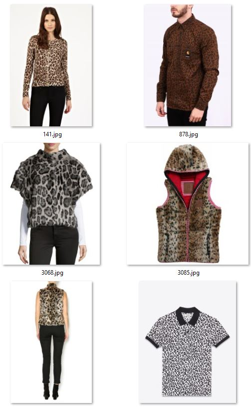
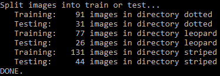
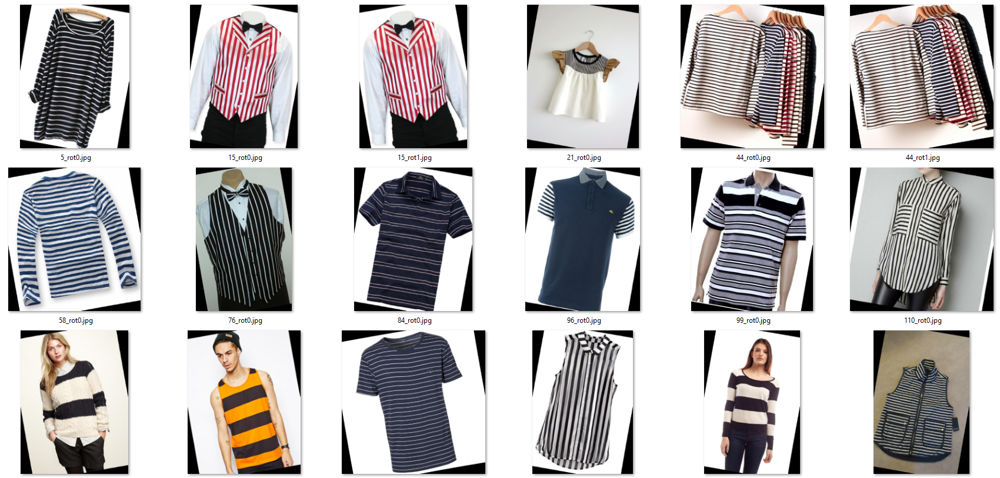
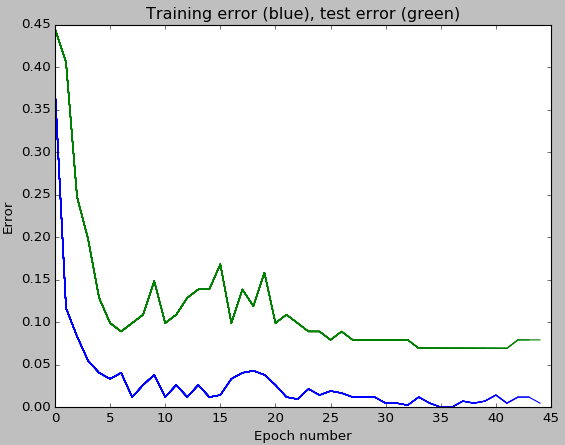
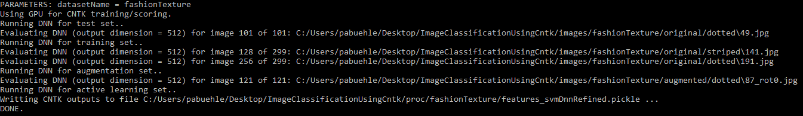
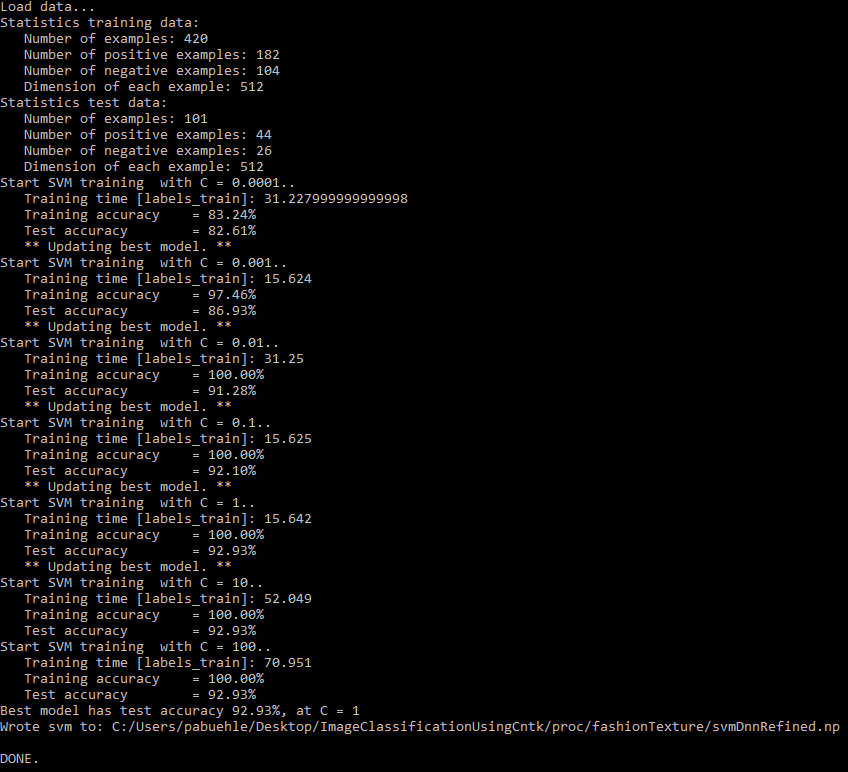
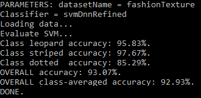
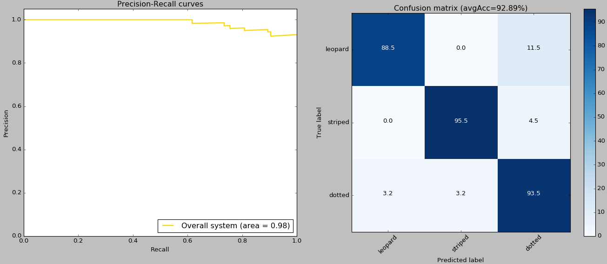
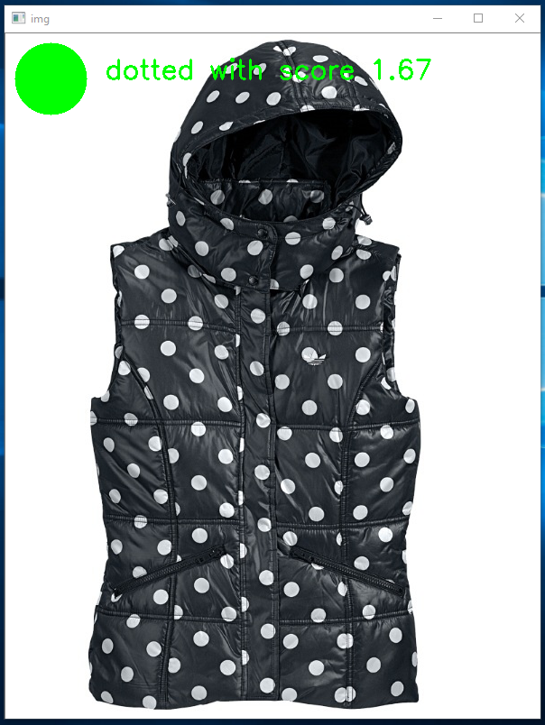
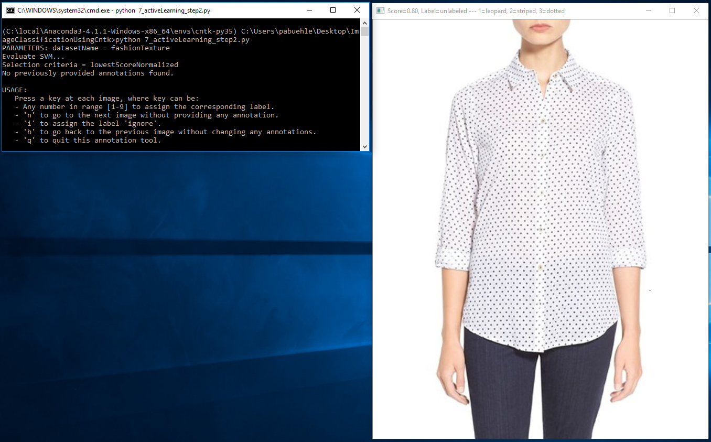

IMAGE CLASSIFICATION USING MICROSOFT COGNITIVE TOOLKIT (CNTK)
==============

---

WARNING:   
This is work in progress...
The code is tested and works with CNTK v2.0, however the documentation is only partially written and might contain errors (since much of it is currently copy & pasted from my other tutorials).

---

Functionality so far:
-	Download images from a provided list of urls
-	Splitting into train vs. test either randomly by filename, randomly by subdirectory, or using a provided list of test images
-	Dataset augmentation by adding rotated version of the training images (Note: CNTK supports other augmentation methods on-the-fly such as horizontal flipping or cropping, but not rotation)
-	(optionally) DNN refinement of a pre-trained ResNet model, with plot of the training and test accuracy as a function of the number of epochs
-	Running the DNN on all images in the dataset
-	(optionally) Training a Linear SVM on the output of the pre-trained (and possibly refined) DNN. Grid-search for the best C parameter, uses an efficient dedicated linear SVM implementation.
-	Quantitative evalutation: computation and plotting of the confusion matrix and precision/recall curve, using the test or the training set
-	Qualitative evaluation: visualization of the results
-	Active learning: UI to manually annotated more images. Images presented to the user are selected from possibly a very large dataset according to user-specfied criteria, e.g. images where the classifier is uncertain or images which are likely false positives.


PREREQUISITES
--------------

This code was tested using CNTK 2.0.0, and assumes that CNTK was installed with the (default)
Anaconda Python interpreter using the [script-driven installation](https://github.com/Microsoft/CNTK/wiki/Setup-Windows-Binary-Script). Note that the code will not run on previous CNTK versions due to breaking changes.

A dedicated GPU, while technically not being required, is however recommended for refining of the DNN. If you lack a strong GPU, don't want to
install CNTK yourself, or want to train on multiple GPUs, then consider using Azure's Data Science Virtual Machine. See the [Deep Learning
Toolkit](https://azuremarketplace.microsoft.com/en-us/marketplace/apps/microsoft-ads.dsvm-deep-learning) for a 1-click deployment solution.

CNTK can be easily installed by following the instructions on the [setup page](https://github.com/Microsoft/CNTK/wiki/Setup-Windows-Binary-Script).
This will also automatically add an Anaconda Python distribution. At the time of writing, the default python version is 3.5 64bit.

Anaconda comes with many packages already pre-installed. The only missing packages are opencv, scikit-learn, and Pillow. These can be installed
easily using *pip* by opening a command prompt and running:
````bash
C:/local/CNTK-2-0/cntk/Scripts/cntkpy35.bat #activate CNTK's python environment
cd resources/python35_64bit_requirements/
pip.exe install -r requirements.txt
````

In the code snippet above, we assumed that the CNTK root directory is  *C:/local/CNTK-2-0/*. The opencv python wheel was originally downloaded
from this [page](http://www.lfd.uci.edu/~gohlke/pythonlibs/).

Troubleshooting:
- The error "Batch normalization training on CPU is not yet implemented" is thrown when trying to train the DNN using a system which does not have a GPU. This is a restriction from CNTK, and can be avoided using either an Azure GPU DSVM for training, or by setting the classifier in `PARAMETERS.py` to 'svm' which essentially deactivates DNN retraining (as explain in XXX).


FOLDER STRUCTURE
--------------

|Folder| Description
|---|---
|/|				                             Root directory
|/images/|			                         Directory containing the image dataset(s)
|/images/fashionTexture/|			             Upper body clothing texture dataset
|/resources/|		                         Directory containing all provided resources
|/resources/cntk/|                           Pre-trained ResNet model
|/resources/libraries/|                      Python library funtions
|/resources/python34_64_bit_requirements/|   Python wheels and requirements file for 64bit Python version 3.4
|/resources/python35_64_bit_requirements/|   Python wheels and requirements file for 64bit Python version 3.5

All scripts are located in the root directory.


PART 1
--------------
In the first part of this tutorial we will train a classifier which uses, but does not modify, a pre-trained deep neural network. The pre-trained DNN will be used as a featurizer, and a linear SVM trained which, given an image, predicts its attribute (ie. if it is dotted, striped, or leopard).

### Image data
`Script: 0_downloadImages.py`

This tutorial uses as running example a small upper body clothing texture dataset consisting of up to 428 images, where each image is annotated as one of 3 different textures (dotted, striped, leopard). All images were scraped using Bing Image Search and hand-annotated as is explained in [Part 2](#using-a-custom-dataset). The image URLs with their respective attributes are listed in the */resources/fashionTextureUrls.tsv* file.

The script `0_downloadImages.py` needs to be executed once and downloads all images to the */images/fashionTexture/original/* directory. Note that some of the 428 URLs are likely broken - this is not an issue, and just means that we have slightly fewer images for training and testing.

The figure below shows examples for the attributes dotted (left two columns), striped (middle two columns), and leopard (right two columns). Note that annotations were done according to the upper body clothing item, and the classifier needs to learn to focus on the relevant part of the image and to ignore all other areas (e.g. pants, shoes).

<p align="center">



</p>

### STEP 1: Data preparation
`Script: 1_prepareData.py`

This script mainly serves two purposes:

1. All images are assigned to be used either for training or for testing. This assignment is mutually exclusive - no training image is also used for testing or vice versa. We use a ratio of 0.75, meaning 75% of the images from each attribute are assigned to training, and the remaining 25% to testing.

2. This assignment of images into training or testing can be used directly to define a training and test set of (image,label) tuples which will be used in step 2 to refine the DNN.

Output of the `1_prepareData.py` script. Note how first images are assigned to either training or testing. This is followed by a sanity check which confirms that the training and test set indeed have no image in common. All data generated by the script is saved in the *proc/fashionTexture/* folder.

<p align="center">

</p>


### STEP 2: Data augmentation
`Script: 2_augmentData.py`

- Augments training set only, keeps test set untouched
- Generates rotated version of (a random subset of) the training images

<p align="center">

</p>

### STEP 3: Refining the Deep Neural Network
`Script: 3_refineDNN.py`

- Uses the original images for training and testing. For training, if present, adds the augmented and active learning images.

The script `3_refineDNN.py` refines a pre-trained Resnet-18 model using the training and test set from step 1. In addition, if present, also adds to the training set the augmentation images from step 2, and the active learning images from step 7.

As was explained in the [Overview](#overview) section, the main difference between DNN refinement and standard DNN training is how the network weights are being initialized: standard training uses randomly sampled values, while refinement uses the weights from a pre-trained network as initialization. The script runs 45 epochs, reports the accuracy on the training and test sets after each epoch, and finally writes the refined model to *proc/fashionTexture/cntk_refined.model*.

In addition, a plot like the one below is drawn which shows how the training and test classification errors change as a function of the number of training epochs. Note that the error of the final model on the training set is much smaller than on the test set. This so-called over-fitting behavior can be reduced e.g. by using a higher value for the dropout rate `rf_dropoutRate`.
<p align="center">

</p>

A GPU is required for model refinement. The script should write the string "Using GPU for training" to the console - if this is not the case then either no GPU was found or the GPU is locked (e.g. by a previous CNTK run). Optionally, one can skip model refinement altogether by setting the `rf_maxEpochs` variable to 0.


### STEP 4: Evaluate DNN for all images
`Script: 4_runDNN`

We can now use the (possibly refined) DNN from the last step to compute a deep representation for all our images. Given an image as input to the DNN, the output is the 512-floats vector from the penultimate layer of the model. This vector, while having much smaller dimensions than the image itself, should nevertheless contain (and even highlight) all information in the image relevant to recognize what attribute the image belongs to, i.e. if the clothing item has a dotted, striped, or leopard texture.

All of the DNN image representations are saved to the file *proc/fashionTexture/cntkFiles/features.pickle*.

<p align="center">

</p>


### STEP 5: Support Vector Machine training
`Script: 5_trainSVM.py`

- Uses the original images for training and testing. For training, if present, adds the augmented and active learning images.

The 512-floats representations computed in the last step are now used to train an image classifier: given an image as input, the SVM outputs a score for each attribute to be present. In our example dataset, this means a score for 'striped', for 'dotted', and for 'leopard'.

Script `5_trainSVM.py` loads the training images, trains the SVM for different values of the slack parameter C, and keeps the SVM with highest accuracy. The classification accuracy is printed to the console for both the training set and the test set. For the provided texture data these values should be around 100% and 93% respectively. Finally, the trained SVM is written to the file *proc/fashionTexture/cntkFiles/svm.np*.

<p align="center">

</p>


### STEP 6: Evaluation and visualization
`Scripts: 6_evaluate.py`

The accuracy of the trained image classifier can be measured using the script `6_evaluate.py`. This scores all test images from step 1 using the trained SVM, assigns each image the attribute with the highest SVM score, and compares the predicted attributes with the ground truth annotations.

The output of script `6_evaluate.py` is shown below. The classification accuracy of each individual class is computed, as well as the accuracy for the full test set ('overall accuracy'), and the average over the individual accuracies ('overall class-averaged accuracy'). 100% corresponds to the best possible accuracy, 0% to the worst, and random guessing would on average produce a class-averaged accuracy of 1 over the number of attributes, ie. in our case this would be 33.33%. These results improve significantly when using a higher input resolution `rf_inputResoluton = 1000` and a higher dropout rate `rf_dropoutRate = 0.9`, however DNN refinement becomes much slower.

<p align="center">

</p>

In addition to accuracy, also the precision recall curve is plotted with respective area-under-curve (left); and the confusion matrix is shown (right):

<p align="center">

</p>

Finally, qualitative visualizations are produced for each image in the test set (see figure below).  The highest score and respective class is shown (here: 'dotted' with score 1.67), in green if the class of the image was correctly predicted, and red otherwise.

<p align="center">

</p>


### STEP 7: Active learning

-	Active learning: UI to manually annotated more images. Images presented to the user are selected from possibly a very large dataset according to user-specfied criteria, e.g. images where the classifier is uncertain or images which are likely false positives.

<p align="center">

</p>
